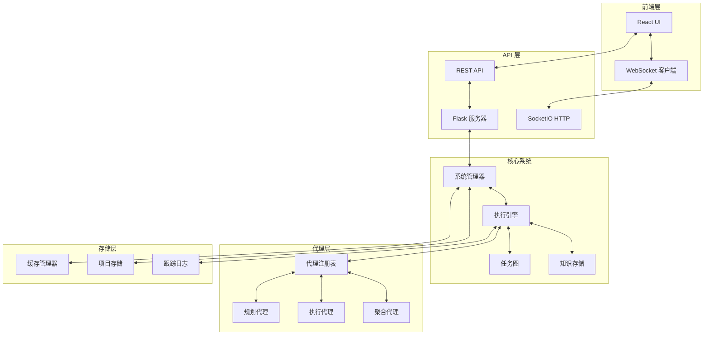
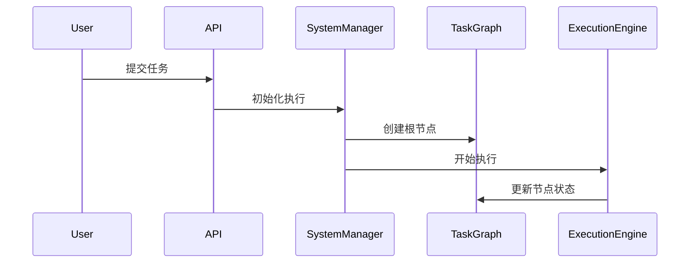
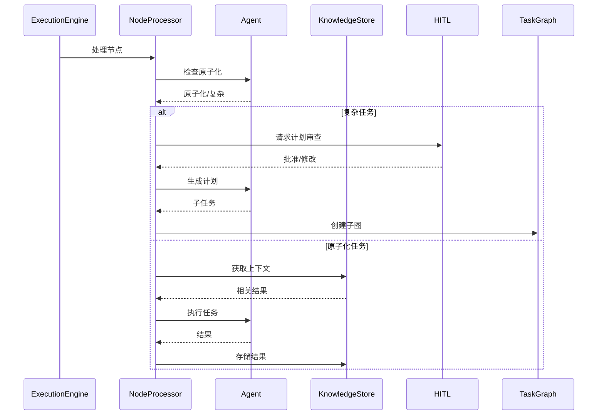
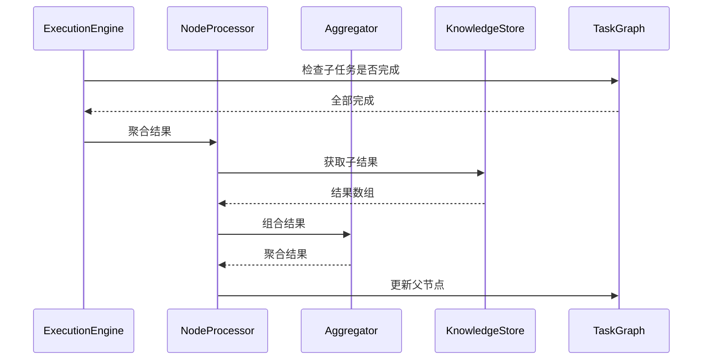

# 🏗️ SentientResearchAgent 架构

## 📋 目录

- [系统概述](#-系统概述)
- [架构原则](#-架构原则)
- [核心组件](#-核心组件)
- [数据流](#-数据流)
- [系统层](#-系统层)
- [组件细节](#-组件细节)
- [通信模式](#-通信模式)
- [存储与持久性](#-存储与持久性)
- [可伸缩性与性能](#-可伸缩性与性能)
- [安全考虑](#-安全考虑)

## 🌐 系统概述

SentientResearchAgent 构建为一个模块化、事件驱动的系统，具有清晰的关注点分离：



## 🎯 架构原则

### 1. **分层任务分解**
- 任务被递归地分解为子任务
- 每个级别维护自己的上下文和状态
- 自下而上的结果聚合

### 2. **代理模块化**
- 代理是可插拔的组件
- 每个代理都有特定的角色和接口
- 易于添加新的代理类型

### 3. **事件驱动执行**
- 状态变化触发事件
- 松散耦合的组件通过事件进行通信
- 通过 WebSocket 实时更新

### 4. **上下文保留**
- 信息在任务之间智能流动
- 结果被缓存和重用
- 操作之间无上下文丢失

### 5. **以人为本的设计**
- 在关键决策点进行 HITL（人在回路）
- 执行的实时可视化
- 干预和修改能力

## 🔧 核心组件

### 1. **系统管理器** (`core/system_manager.py`)

初始化和管理所有系统组件的中央协调器：

```python
class SystemManagerV2:
    - config: SentientConfig
    - task_graph: TaskGraph
    - knowledge_store: KnowledgeStore
    - execution_orchestrator: ExecutionOrchestrator
    - agent_registry: AgentRegistry
    - hitl_service: HITLService
```

**职责**：
- 组件生命周期管理
- 配置传播
- 配置文件加载和管理
- WebSocket HITL 设置

### 2. **任务图** (`graph/task_graph.py`)

管理任务的层次结构：

```python
class TaskGraph:
    - nodes: Dict[str, TaskNode]
    - edges: Set[Tuple[str, str]]
    - sub_graphs: Dict[str, TaskGraph]
```

**特点**：
- 有向无环图（DAG）结构
- 支持子图以实现分层分解
- 依赖跟踪
- 循环检测

### 3. **任务节点** (`node/task_node.py`)

工作的原子单元：

```python
class TaskNode:
    - task_id: str
    - goal: str
    - task_type: TaskType (SEARCH, WRITE, THINK)
    - node_type: NodeType (PLAN, EXECUTE)
    - status: TaskStatus
    - layer: int
    - result: Any
    - sub_graph_id: Optional[str]
```

**状态**：
- `PENDING` → `READY` → `RUNNING` → `DONE`/`FAILED`
- `PLAN_DONE` → `AGGREGATING` → `DONE` (用于 PLAN 节点)

### 4. **执行引擎** (`graph/execution_engine.py`)

协调任务执行：

```python
class ExecutionEngine:
    - run(): 主执行循环
    - process_ready_nodes(): 处理准备好执行的节点
    - update_node_statuses(): 状态转换管理
```

**执行策略**：
- 独立任务的并发执行
- 依赖感知调度
- 死锁检测和恢复

### 5. **节点处理器** (`node/node_processor.py`)

处理单个节点：

```python
class NodeProcessor:
    - process_node(): 主处理入口点
    - _process_plan_node(): 处理规划任务
    - _process_execute_node(): 处理执行任务
    - _process_aggregation(): 处理结果聚合
```

**处理流程**：
1. 原子化检查（任务是否可以直接执行？）
2. 上下文构建（收集相关信息）
3. 代理选择和调用
4. 结果存储和传播

### 6. **代理注册表** (`agents/registry.py`)

管理可用代理：

```python
class AgentRegistry:
    - register_agent(): 添加新代理
    - get_agent(): 根据标准检索代理
    - list_agents(): 获取可用代理
```

**代理类型**：
- **原子化器**：确定任务是否需要分解
- **规划器**：分解复杂任务
- **执行器**：执行实际工作
- **聚合器**：组合结果

### 7. **知识存储** (`context/knowledge_store.py`)

管理执行上下文和结果：

```python
class KnowledgeStore:
    - store_result(): 保存任务结果
    - get_relevant_results(): 检索上下文
    - get_lineage_results(): 获取父级/同级结果
```

## 🔄 数据流

### 1. **任务初始化**



### 2. **任务处理**



### 3. **结果聚合**



## 🏛️ 系统层

### 1. **表示层**

**前端 (React/TypeScript)**
- 实时任务可视化
- HITL 交互界面
- WebSocket 事件处理
- 状态管理 (Zustand)

**关键组件**：
- `TaskGraphVisualization`: 可视化任务树
- `HITLModal`: 人工审查界面
- `WebSocketManager`: 实时通信

### 2. **API 层**

**Flask 服务器**
- 用于 CRUD 操作的 RESTful 端点
- 通过 SocketIO 支持 WebSocket
- 请求验证和路由

**端点**：
- `/api/projects/*`: 项目管理
- `/api/execute`: 任务执行
- `/api/websocket`: 实时事件

### 3. **业务逻辑层**

**核心服务**：
- 任务分解和规划
- 代理选择和调用
- 上下文构建和传播
- 状态管理和转换

### 4. **数据访问层**

**存储组件**：
- 基于文件的项目持久化
- 通过 goofys 可选的 S3 挂载集成
- 内存知识存储
- 缓存管理
- 跟踪日志记录

## 📡 通信模式

### 1. **WebSocket 事件**

```typescript
// 前端 → 后端
interface ExecuteRequest {
  goal: string;
  profile?: string;
  config?: ExecutionConfig;
}

// 后端 → 前端
interface TaskUpdate {
  node: TaskNode;
  graph: TaskGraph;
  timestamp: number;
}
```

### 2. **HITL 通信**

```typescript
interface HITLRequest {
  checkpoint: string;
  node_id: string;
  context: any;
  data_for_review: any;
}

interface HITLResponse {
  action: 'approve' | 'modify' | 'abort';
  modification_instructions?: string;
}
```

### 3. **代理通信**

```python
# 代理输入
class AgentTaskInput:
    task: TaskNode
    relevant_context: List[Dict[str, Any]]
    
# 代理输出
class AgentOutput:
    result: Any
    confidence: float
    metadata: Dict[str, Any]
```

## 💾 存储与持久性

### 1. **项目存储**

```
runtime/projects/
├── project_id/
│   ├── metadata.json
│   ├── task_graph.json
│   ├── knowledge_store.json
│   └── traces/
```

### 2. **缓存系统**

```
runtime/cache/
├── agent/
│   ├── response_cache.json
│   └── context_cache.json
```

### 3. **紧急备份**

```
experiments/emergency_backups/
├── execution_id_timestamp_emergency.json
```

## ⚡ 可伸缩性与性能

### 1. **优化策略**

- **批量更新**：减少 WebSocket 消息频率
- **缓存上下文**：重用计算出的上下文
- **并行执行**：并发处理独立任务
- **延迟加载**：仅在需要时加载数据

### 2. **性能调优**

```yaml
execution:
  max_concurrent_nodes: 10
  state_batch_size: 50
  ws_batch_timeout_ms: 100
  enable_immediate_slot_fill: true
```

### 3. **瓶颈缓解**

- **代理响应缓存**：减少 LLM API 调用
- **上下文压缩**：最小化内存使用
- **智能调度**：优先处理关键路径任务

## 🔐 安全考虑

### 1. **API 安全**

- 输入验证和净化
- 每个端点的速率限制
- API 密钥管理

### 2. **数据保护**

- 从日志中排除敏感数据
- 安全存储 API 密钥
- 用户数据隔离

### 3. **执行安全**

- 代理沙盒
- 资源限制
- 超时强制

## 🎯 关键设计决策

### 1. **为什么是分层结构？**
- 自然的问题分解
- 并行执行机会
- 清晰的进度跟踪
- 人类可理解的结构

### 2. **为什么基于代理？**
- 针对不同任务的专业化
- 易于扩展
- 供应商独立性
- 社区贡献

### 3. **为什么是事件驱动？**
- 实时更新
- 松散耦合
- 更好的可测试性
- 可伸缩架构

### 4. **为什么集成 HITL？**
- 质量控制
- 持续改进
- 建立信任
- 训练数据生成

## 🚀 未来架构增强

### 近期
- 分布式执行支持
- 增强缓存策略
- 插件架构
- 指标和监控
- 更好的上下文管理
- 以任务为中心、独立的子代理

### 长期
- 多代理协作协议
- 自修改任务图
- 跨系统联邦
- 基于区块链的代理市场

---

## 📚 相关文档

- [核心概念](CORE_CONCEPTS.md) - 理解基本概念
- [执行流程](EXECUTION_FLOW.md) - 详细执行演练
- [代理指南](AGENTS_GUIDE.md) - 使用代理系统
- [API 参考](API_REFERENCE.md) - 完整的 API 文档